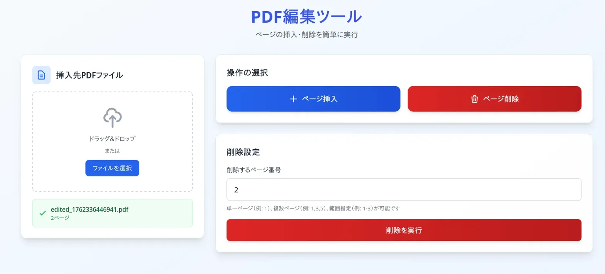
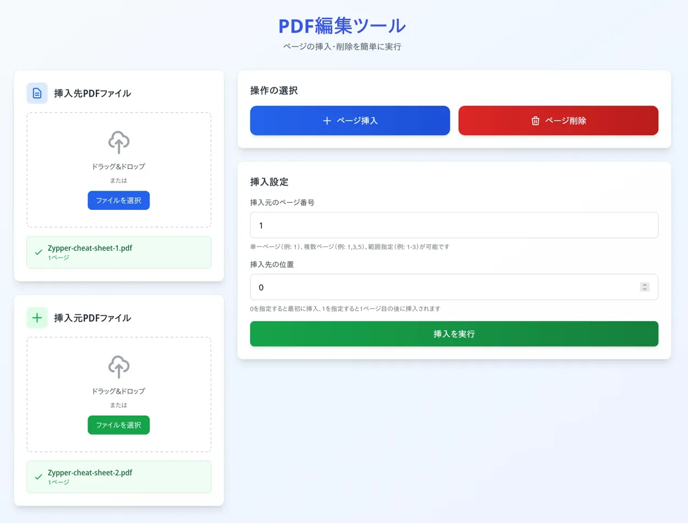

# PDF編集ツール

Webブラウザ上で動作するPDFページ編集アプリケーションです。  
サーバへのアップロードが不要で、クライアント側で完結するため、セキュアな環境でPDFファイルのページ挿入および削除が可能です。

## 概要

本ツールは、PDFファイルに対して特定のページを挿入したり、不要なページを削除したりする操作を、直感的なユーザインターフェースで実現します。  
pdf-libライブラリを使用しており、全ての処理はブラウザ内で完結します。  

## 主な機能

### ページ挿入機能
挿入先PDFファイルに対して、別のPDFファイルから選択したページを任意の位置に挿入することができます。  

- **単一ページ挿入**: 特定の1ページのみを挿入（例: `1`）
- **複数ページ挿入**: 複数のページを同時に挿入（例: `1,3,5`）
- **範囲指定挿入**: 連続したページ範囲を一括挿入（例: `1-3`）
- **柔軟な挿入位置**: 任意の位置への挿入が可能（0を指定すると最初に挿入、1を指定すると1ページ目の後に挿入）

### ページ削除機能
挿入先PDFファイルから指定したページを削除することができます。  

- **単一ページ削除**: 特定の1ページのみを削除（例: `2`）
- **複数ページ削除**: 複数のページを同時に削除（例: `1,3,5`）
- **範囲指定削除**: 連続したページ範囲を一括削除（例: `1-3`）

### ドラッグ&ドロップ対応
ファイル選択ボタンだけでなく、ドラッグ&ドロップでのファイル読み込みに対応しており、スムーズな操作が可能です。  

## スクリーンショット

### ページ削除画面


挿入先PDFファイルを読み込み、削除したいページ番号を指定して削除操作を実行する画面です。  

### ページ挿入画面


挿入先PDFファイルと挿入元PDFファイルの両方を読み込み、挿入元のページ番号と挿入位置を指定して挿入操作を実行する画面です。  

## 技術仕様

### 使用技術

- **HTML5**: ページ構造とマークアップ
- **CSS3 (Tailwind CSS)**: レスポンシブデザインとスタイリング
- **JavaScript (ES6+)**: アプリケーションロジック
- **pdf-lib**: PDF操作ライブラリ
- **File System Access API**: ファイル保存ダイアログの表示（対応ブラウザのみ）

### 主な特徴
- **クライアントサイド処理**: 全ての処理がブラウザ内で完結し、ファイルが外部に送信されることはありません
- **セキュア**: サーバへのアップロードが不要なため、機密性の高いPDFファイルも安全に編集できます
- **レスポンシブデザイン**: デスクトップからタブレットまで、様々な画面サイズに対応しています

## セットアップ

### 必要なファイル構成

```
project/
├── pdf-editor.html
├── css/
│   └── tailwind.css
├── js/
│   └── pdf-lib.min.js
├── img/
│   ├── Delete.png
│   └── Insert.png
└── README.md
```

### インストール手順

1. ファイル構成に従って、各ファイルを適切なディレクトリに配置します。

2. `pdf-editor.html`をWebブラウザで開きます。

## 使用方法

### ページ削除の手順

1. 挿入先PDFファイルエリアに、編集対象のPDFファイルをドラッグ&ドロップするか、「ファイルを選択」ボタンから選択します。
2. 「ページ削除」ボタンをクリックします。
3. 削除するページ番号を入力します（例: `2` または `1,3,5` または `1-3`）。
4. 「削除を実行」ボタンをクリックします。
5. 処理完了後、「編集済みPDFをダウンロード」ボタンから編集されたPDFファイルを保存します。

### ページ挿入の手順

1. 挿入先PDFファイルエリアに、ベースとなるPDFファイルをドラッグ&ドロップするか、「ファイルを選択」ボタンから選択します。
2. 「ページ挿入」ボタンをクリックします。
3. 挿入元PDFファイルエリアに、挿入したいページを含むPDFファイルをドラッグ&ドロップするか、「ファイルを選択」ボタンから選択します。
4. 挿入元のページ番号を入力します（例: `1` または `1,3,5` または `1-3`）。
5. 挿入先の位置を入力します（0を指定すると最初に挿入されます）。
6. 「挿入を実行」ボタンをクリックします。
7. 処理完了後、「編集済みPDFをダウンロード」ボタンから編集されたPDFファイルを保存します。

## ブラウザ互換性

### 推奨ブラウザ
- Google Chrome (最新版)
- Microsoft Edge (最新版)
- Opera (最新版)

### ファイル保存機能について

本ツールではFile System Access APIを使用しており、対応ブラウザではファイル保存ダイアログが表示され、保存先を自由に選択することができます。  
ただし、File System Access APIは現時点ではFirefoxでサポートされていないため、ChromeやEdge等のChromiumベースのブラウザでのみ利用可能となっています。  

<br>

Firefoxをご使用の場合、編集済みPDFファイルはブラウザのデフォルトダウンロードフォルダに自動的に保存されます。  
この動作はブラウザの仕様によるものであり、本ツールの制限ではございません。  

### 動作確認済み環境
- Google Chrome 120以降
- Microsoft Edge 120以降
- Opera 105以降
- Firefox 120以降（ファイル保存ダイアログは非対応）

## 注意事項

- 編集するPDFファイルのサイズや複雑さによっては、処理に時間がかかる場合があります。
- 一部の保護されたPDFファイルや、特殊な構造を持つPDFファイルは正常に処理できない場合があります。
- 全てのページを削除することはできません（最低1ページは残る必要があります）。
- 本ツールで生成されたPDFファイルは、元のPDFファイルの品質を保持しますが、一部のメタデータやフォーム情報が失われる可能性があります。

## ライセンス

本プロジェクトは個人利用および商用利用が可能です。  
pdf-libライブラリのライセンスについては、[公式ドキュメント](https://pdf-lib.js.org/)をご参照ください。

## 技術サポート

問題が発生した場合や機能改善の提案がございましたら、プロジェクトの管理者までご連絡ください。  

---

**開発環境**: HTML5 / CSS3 / JavaScript ES6+  
**最終更新**: 2025年11月
